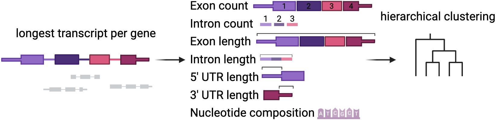
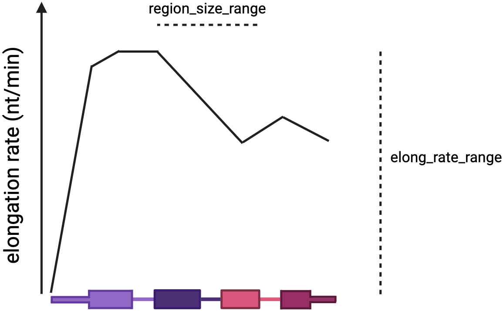
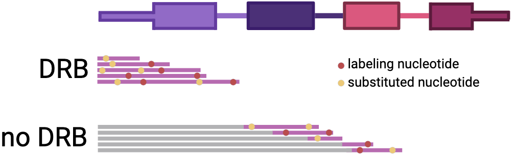

# SPARK: a nascent RNA simulator

SPARK (Simulated Pre-mRNA and RNA Kinetics) is a pipeline to generate _in silico_ nascent RNA datasets for short- or long-read RNA-sequencing to use in the optimization and validation of nascent RNA analyses.

In brief, these simulations generate reads from annotated mRNA isoforms and model transcription elongation rates for each nucleotide across a chosen number of genes. User-defined simulation parameters can be tuned to vary across a range of experimental conditions to generate data expected from approaches such as 4sU-seq, TT-seq, TimeLapse-seq, eSLAM-seq, 4sUDRB-seq, etc.

### Requirements (versions used for development)
- python (v3.12.9)
- bedtools (v2.31.1)
- R (v4.3.3)
- bash (v4.4.20)
- awk (v4.2.1)

#### Python Dependencies
- numpy (v2.2.3)
- pandas (v2.2.3)

#### R Dependencies
- data.table (v1.17.0)
- dplyr (v1.1.4)
- optparse (v1.7.5)
- R.utils (v2.13.0)
- tidyr (v1.3.1)
- magrittr (v2.0.3)
- scales (v1.3.0)


A spark.yml conda environment is provided.
## Table of Contents

[Overview of SPARK (full pipeline)](#overview-of-spark)

[Gene Selection](#step-1-gene-selection)

[Elongation Rates](#step-2-elongation-rates)

[Nascent RNA Labeling](#step-3-nascent-rna-labeling)

[Read Generation](#step-4-read-generation)

[Ground truth](#ground-truth)


## Overview of SPARK

The SPARK pipeline was designed to be run either as a single continuous pipeline or in individual modes to generate genes, transcription elongation rates, nascent RNA enrichment, or reads. Here, we describe the usage of the _fullpipeline_ mode and, below, we provide sections that discuss each of the other modes individually and alternative parameter usage.

```
usage: spark.py
options:
  -h, --help            show this help message and exit

general arguments:
  --mode {fullpipeline,tsvgeneration,rates_per_region,labeling_strategy,seq_tech}
                        pipeline step to run (default: None)
  -o O                  output directory (default: ./)

tsv generation:
  --gtf GTF             genome annotation file (default: None)
  --genome_fasta GENOME_FASTA
                        genome fasta file (default: None)
  --protein_coding_only
                        only use protein-coding genes (default: False)
  --threads THREADS     Number of threads (default: 1)
  --n_gene_clusters N_GENE_CLUSTERS
                        number of gene clusters (default: 6)
  --n N                 number of genes (default: 120)

rates per region:
  --region_size_range REGION_SIZE_RANGE
                        range of region sizes (default: 100,5000)
  --elong_rate_range ELONG_RATE_RANGE
                        range of elongation rates (default: 500,5000)
  --pause_elong_rate PAUSE_ELONG_RATE
                        elongation rate at pause sites (default: 0)
  --pause_occur_chance PAUSE_OCCUR_CHANCE
                        chance of a pause region (default: 0)
  --flat_rates          all nucleotides have the same elongation rate (default: False)
  --gene_level          get only one region across the gene (default: False)

labeling strategy:
  --l L                 labeling time in minutes (default: 15)
  --seq_err SEQ_ERR     sequencing error rate (default: 0.0001,0.0002)
  --nt_inc_rate NT_INC_RATE
                        Comma-separated range of nucleotide incorporation proportions (default: 0.09,0.1)
  --subs_rate SUBS_RATE
                        Comma-separated range of nucleotide substitution proportions (default: 0.95,1)
  --sub_type SUB_TYPE   substitution type (default: T,T)
  --bkg_molecules BKG_MOLECULES
                        proportion of molecules that are background (default: 0)
  --treatment TREATMENT
                        treatment condition (default: no DRB)

sequencing strategy:
  --seq_tech {longread,shortread}
                        sequencing technology (default: shortread)
  --seq_type {RNA,cDNA,SE,PE}
                        sequencing type (default: SE)
  --seq_depth SEQ_DEPTH
                        total library sequencing depth (default: 20000000)
  --insert_size INSERT_SIZE
                        length of insert (default: 200,300)
  --tpm TPM             range of TPMs genes can have (default: 5,200)
  --read_length READ_LENGTH
                        length of each read (default: 100)
  --s {rf,fr,unstranded}
                        library strandedness (default: rf)
```

**Snippet to generate 100nt fr-firststrand paired-end reads from 1000 genes simulated from a Timelapse-seq library:**
```
spark.py --mode fullpipeline -o ./pipeline_out/  --n 1000 --gtf GRCh38.95.gtf --genome_fasta GRCh38.fa --sub_type T,C --seq_tech shortread --s rf  --seq_type PE
```

SPARK can be run in full or as specific modules to change specific parameters of the simulation while keeping others constant.


### Step 1: Gene Selection

**Clustering by gene features (--mode tsvgeneration)**

Rather than simulating random sequences, SPARK simulates reads from a user-provided reference genome to create more representative nucleotide content across reads. This mode analyzes sequence and isoform features (see figure) for all annotated genes in the provided genome, using the longest isoform per gene. Hierarchical clustering is then performed using these features to define groups of isoforms with similar metrics. The output is a tsv file per gene, where each row is a feature (exon or intron) and the last column contains the sequence for that feature.



### Step 2: Elongation Rates. 

**Assigning an RNA Pol II elongation rate per nucleotide (--mode rates_per_region)**

To simulate the variability in elongation rates across the gene sequence, this mode will assign an elongation rate (between the values specified on --elong_rate_range) to each nucleotide of the isoform.

Two output files per gene will be in the rate_per_gene directory and can be used as a ground truth to evaluate elongation rate estimation. The _RatesandTraversalTimes_ files contain the elongation rate per nucleotide, while the _VariableElongationRateRegions_ files contain the elongation rate variability information per region (see the “ground truth” section below).

Each gene will have a number of regions depending on the user-defined values (--region_size_range option). Within each region, the elongation rate (in nt/min) for each nucleotide changes linearly from the rate at the first nucleotide to the rate at the last nucleotide in that region. For example, if a region contains 10 nucleotides, with the first nucleotide having an elongation rate of 1 and the last nucleotide having a rate of 2, the elongation rates for the nucleotides will increase evenly from 1 to 2. In this case, the second nucleotide will have a rate of 1.11, the third will have 1.22, the fourth 1.33, and so on, up to 2 at the last nucleotide. If --flat_rates is added, then all the nucleotides within the same region will have the same elongation rate. If both --flat_rates and --gene_level are added, all the nucleotides will have the same elongation rate.

Pauses can be added by setting the chances of a pausing event to happen with the --pause_occur_chance parameter being higher than 0.


###  Step 3: Nascent RNA Labeling

**mRNA generation (--mode labeling_strategy)**

SPARK first simulates full-length mRNA isoforms based on the elongation rates generated by --mode rates_per_region. The user can opt to simulate a DRB-treated like 4sUDRB-seq, in which transcription is synchronized such that all RNAPIIs initiate at the TSS at the beginning of the nascent RNA experiment, or a native context in which RNAPII can be anywhere within the gene at the beginning of the nascent RNA experiment. 


In this version of SPARK, we do not consider splicing, so there are no breaks in the isoform. If chosen to be simulated, background molecules are made as fully transcribed and unspliced molecules. If no labeling-driven substitutions are necessary, subs_rate should be set to 0.

In this stage, SPARK simulates full-length mRNA isoforms based on elongation rates previously estimated by the rates_per_region module. The simulation can follow one of two biological scenarios. In a synchronized context—like in 4sUDRB-seq experiments—transcription is initiated simultaneously across all genes, with RNAPII beginning at the transcription start site at the start of the labeling window. In contrast, the native context assumes a steady-state transcriptional landscape, where RNAPIIs are already distributed along the gene body when labeling begins. This can be modulated using DRB or no DRB under the --treatment parameter.

This version of SPARK does not model splicing, so transcripts are simulated as continuous, uninterrupted isoforms. If background molecules are included, they are assumed to be fully elongated and unspliced, representing transcripts not generated during the labeling window.

The duration of labeling is specified with the --l option, which determines how long RNAPII are allowed to elongate for. During this time, labeled nucleotides can be incorporated to nascent mRNA molecules at rates defined by --nt_inc_rate, which reflects the efficiency of analog incorporation into nascent RNA. Once incorporated, these labeled nucleotides may undergo chemical substitutions or sequencing-induced artifacts, with a probability defined by --subs_rate. The nature of these substitutions is set with --sub_type, for example, with T-to-C conversions as commonly observed in 4sU experiments. If an experiment without nucleotide analogs wants to be simulated, then the user can set --nt_inc_rate to 0.

Sequencing error is modeled separately using the --seq_err option, allowing for realistic simulation of background sequencing noise. Any base will have a seq_err probability of getting a random error.

SPARK also allows for simulation of background transcripts—those not originating during the labeling window that are sequenced, for example, due to a lack of pulldown specificity—via the --bkg_molecules parameter, which defines what proportion of the molecules should be considered background. These are modeled as fully transcribed, unspliced transcripts. F

### Step 4: Read Generation

**Read generation (--mode seq_tech)**

SPARK can generate either short or long-read sequencing reads from the mRNA isoforms simulated in --mode labeling_strategy. For long-reads, strandness refers to the default Oxford Nanopore considerations, where directRNA is sequenced from 3’ to 5’ and cDNA can be sequenced from either end.

SPARK can generate either short-read or long-read sequencing data from the mRNA isoforms produced in the --mode labeling_strategy step. The choice of sequencing technology is specified with the --seq_tech option, which supports "shortread" (Illumina-like) or "longread" (e.g., Oxford Nanopore Technologies). By default, SPARK simulates short-read sequencing.

To realistically simulate the number of reads per gene according to isoform abundance, a value from the --tpm range is assigned to each gene; the tpm is then extrapolated to the total library --seq_depth that represents the total number of reads that the reads come from. These two parameters will determine how many reads per gene are simulated.

For short-read simulations, fragmentation and size selection are modeled after the protocol described in [Pai et al, elife 2017](https://elifesciences.org/articles/32537). Fragment insert sizes can be tuned via the --insert_size option. The actual length of each sequencing read—applicable primarily for short reads—is set using the --read_length parameter. The --seq_type option accepts "SE" (single-end) or "PE" (paired-end), with "SE" as the default. Finally, the short-read library's strand specificity is defined using the --s option. Available choices include "rf" (reverse-forward), "fr" (forward-reverse), or "unstranded". By default, SPARK assumes "rf" strandedness, which is typical for dUTP-based strand-specific RNA-seq protocols.

For long-read data, SPARK accounts for strand-specific considerations inherent to Oxford Nanopore's strandness data: in the directRNA approach, transcripts are sequenced in the 3′ to 5′ direction, while cDNA reads may originate from either end. This behavior is controlled using the --seq_type option, which can be set to "RNA" or "cDNA" for long reads. 


### Ground truth

Three types of ground truth information are stored to use in downstream analyses of the simulations:

1. Regions over which elongation rates are varied, which are stored in the _VariableElongationRateRegions_ files containing the elongation rate information per region:
| chromosome  | gene chromosome |
| absolute_start  | absolute start position of the region |
| absolute_end  | absolute end position of the region |
| region_start_coord  | relative start position of the region |
| region_end_coord  | relative end position of the region |
| strand  | strand |
| rate_initial  | elongation rate in bp per minute for the first nucleotide in the region |
| rate_final  | elongation rate in bp per minute for the last nucleotide in the region |
| rate_change_per_nt  | change in rate for each individual nucleotide in the region |
| time_to_traverse  | time to traverse the entire region |
| sequence  | region sequence |
| region_number  | gene region the nucleotide belongs to|

2. Per nucleotide elongation rates, which is stored in the _RatesandTraversalTimes_ files:
| chromosome  | gene chromosome |
| absolute_position  | absolute position of each nucleotide |
| strand  | strand |
| region_number  | gene region the nucleotide belongs to|
| nucleotide_coord  | relative position of the nucleotide within the gene |
| time_for_this_nt | time in minutes required to traverse the nucleotide |
| rate_for_this_nt | elongation rate in bp per minute for the nucleotide |
| rate_change_per_nt | elongation rate change between nucleotide n and n+1 |
3. Per nucleotide substitutions. 

The read names contain information about the gene that the read belongs to, and the number and position of converted nucleotides in the read. For example:

```
@2LOX927M95Izmqeh_ENSG00000229327_subs3:74,29,95
Read ID: 2LOX927M95Izmqeh
Gene ID: ENSG00000229327
Number of substitutions: 3
Position of the substitutions in the read: 74,29,95
```
```
@2LOX927M95Izaouk_ENSG00000229327_subs0:
Read ID: 2LOX927M95Izaouk
Gene ID: ENSG00000229327
Number of substitutions: 0
Position of the substitutions in the read:
```

Each read's ID begins with a capitalized section; reads coming from the same mRNA molecule share this capitalized ID prefix. A lowercase suffix will then differentiate individual reads. For read pairs, both reads will have identical IDs.
