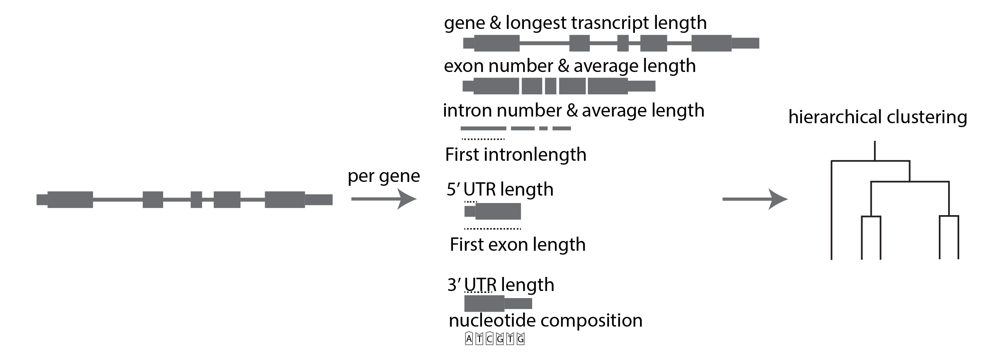
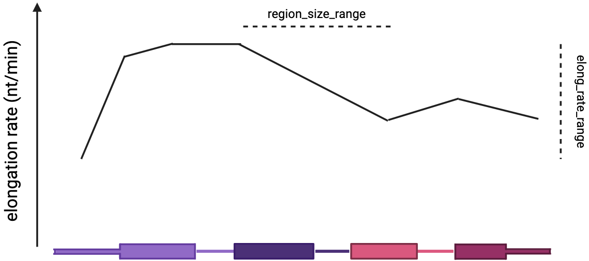
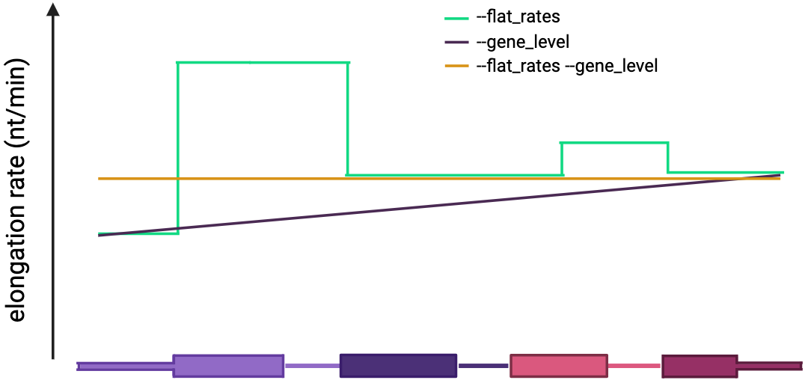
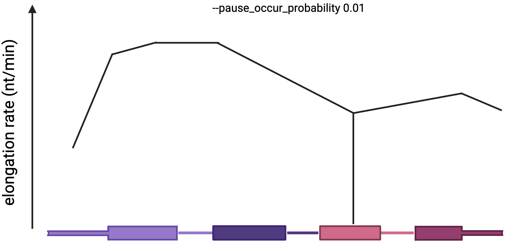

# SPARK: a nascent RNA simulator

SPARK (Simulated Pre-mRNA and RNA Kinetics) is a pipeline to generate _in silico_ nascent RNA datasets for short- or long-read RNA-sequencing to use in the optimization and validation of nascent RNA analyses.

In brief, these simulations generate reads from annotated mRNA isoforms and model transcription elongation rates for each nucleotide across a chosen number of genes. User-defined simulation parameters can be tuned to vary across a range of experimental conditions to generate data expected from approaches such as 4sU-seq, TT-seq, TimeLapse-seq, eSLAM-seq, 4sUDRB-seq, etc.

### Requirements (versions used for development)
- python (v3.12.9)
- bedtools (v2.31.1)
- R (v4.3.3)
- bash (v4.4.20)
- awk (v4.2.1)

#### Python Dependencies
- numpy (v2.2.3)
- pandas (v2.2.3)

#### R Dependencies
- data.table (v1.17.0)
- dplyr (v1.1.4)
- optparse (v1.7.5)
- R.utils (v2.13.0)
- tidyr (v1.3.1)
- magrittr (v2.0.3)
- scales (v1.3.0)


A spark.yml conda environment is provided.
## Table of Contents

[Overview of SPARK (full pipeline)](#overview-of-spark)

[1. Gene Selection](#step-1-gene-selection)

[2. Elongation Rates](#step-2-elongation-rates)

[3. Nascent RNA Labeling](#step-3-nascent-rna-labeling)

[4. Read Generation](#step-4-read-generation)

[NOTE: Ground truth](#ground-truth)


## Overview of SPARK

The SPARK pipeline was designed to be run either as a single continuous pipeline or in individual modes to generate genes, transcription elongation rates, nascent RNA enrichment, or reads. Here, we describe the usage of the _fullpipeline_ mode and, below, we provide sections that discuss each of the other modes individually and alternative parameter usage.

```
usage: spark.py
options:
  -h, --help            show this help message and exit

general arguments:
  --mode {fullpipeline,tsvgeneration,rates_per_region,labeling_strategy,seq_tech}
                        pipeline step to run (default: None)
  -o O                  output directory (default: ./)
  --seed SEED           random seed for reproducibility (default: None)

tsv generation:
  --gtf GTF             genome annotation file (default: None)
  --genome_fasta GENOME_FASTA
                        genome fasta file (default: None)
  --protein_coding_only
                        only use protein-coding genes (default: False)
  --threads THREADS     Number of threads (default: 1)
  --n_gene_clusters N_GENE_CLUSTERS
                        number of gene clusters (default: 6)
  --n N                 number of genes (default: 120)

rates per region:
  --region_size_range REGION_SIZE_RANGE
                        range of region sizes to split the gene into (default: None)
  --num_regions NUM_REGIONS
                        desired number of regions to split the gene into (default: None)
  --elong_rate_range ELONG_RATE_RANGE
                        range of elongation rates (default: 500,5000)
  --pause_occur_probability PAUSE_OCCUR_PROBABILITY
                        probability of having a pausing event across the isoform (default: 0)
  --pause_time PAUSE_TIME
                        length of the pausing event in minutes (default: 0.1,0.5)
  --flat_rates          all nucleotides have the same elongation rate (default: False)

labeling strategy:
  --labeling_time LABELING_TIME
                        labeling time in minutes (default: 15)
  --seq_err SEQ_ERR     sequencing error rate (default: 0.0001,0.0002)
  --nt_inc_prob NT_INC_PROB
                        Comma-separated range of nucleotide incorporation probability (default: 0.09,0.1)
  --subs_prob SUBS_PROB
                        Comma-separated range of nucleotide substitution proportions (default: 0.95,1)
  --sub_type SUB_TYPE   substitution type (default: T,T)
  --bkg_molecules BKG_MOLECULES
                        proportion of molecules that are derived from non-labeled RNA (default: 0)
  --drb                 DRB treatment experiment for transcription synchronization (default: False)

sequencing strategy:
  --seq_tech {longread,shortread}
                        sequencing technology (default: shortread)
  --seq_type {RNA,cDNA,SE,PE}
                        sequencing type (default: SE)
  --seq_depth SEQ_DEPTH
                        total library sequencing depth (default: 20000000)
  --insert_size INSERT_SIZE
                        length of insert (default: 200,300)
  --tpm TPM             range of TPMs genes can have (default: 5,200)
  --read_length READ_LENGTH
                        length of each read (default: 100)
  --s {rf,fr,unstranded}
                        library strandedness (default: rf)
```

**Snippet to generate 100nt fr-firststrand paired-end reads from 1000 genes simulated from a Timelapse-seq library:**
```
spark.py --mode fullpipeline -o ./pipeline_out/  --n 1000 --gtf GRCh38.95.gtf --genome_fasta GRCh38.fa --sub_type T,C --seq_tech shortread --s rf  --seq_type PE
```

SPARK can be run in full or as specific modules to change specific parameters of the simulation while keeping others constant. User can choose to input a seed to replicate the randomly assigned values (e.g. elongation rates) across runs.


### Step 1: Gene Selection

**Clustering by gene features (```--mode tsvgeneration```)**

Rather than simulating random sequences, SPARK simulates reads from a user-provided reference genome to create more representative nucleotide content across reads. This mode analyzes sequence and isoform features (see figure) for all annotated genes in the provided genome, using the longest isoform per gene. Hierarchical clustering is then performed using these features to define groups of isoforms with similar metrics. The output is a tsv file per gene, where each row is a feature (exon or intron) and the last column contains the sequence for that feature.



### Step 2: Elongation Rates. 

**Assigning an RNA Pol II elongation rate per nucleotide (```--mode rates_per_region```)**

RNAPII elongation rates are likely not static across a gene. Additionally, any changes in elongation rats likely occur continuously, rather than in a step-wise fashion. To simulate the variability in elongation rates across the gene sequence, this mode will assign an elongation rate (in the range specified by ```--elong_rate_range```) to each nucleotide of the isoform. Elongation rates within this range are assigned to regions whose length is chosen from the range specified by ```--region_size_range```. Within each region, the elongation rate (in nt/min) changes linearly from the rate at the first nucleotide to the rate at the last nucleotide in that region. For example, in a 10nt region that starts at 1 nt/min and ends at 2nt/min, nucleotide #1 = 1 nt/min, #2 = 1.22, #3 = 1.33, ... until #10 at 2 nt/min.  



To simulate step-wise changes in elongation rates, users can specify ```--flat_rates``` to ensure all the nucleotides in a region have the same elongation rate. To simulate a single elongation region across the entire gene, users can specify  the number of regions with a the same elongation rate per nucleotide using ```--num_regions```.  Specifying both ```--flat_rates``` and ```--num_regions 1``` will create a single, non-varying elongation rate across the entire gene.




Finally, there is evidence that RNAPII can pause throughout a gene. Pauses in RNAPII elongation can be added at random nucleotides by specifying ```--pause_occur_probability```. Specifically, this sets a probability of each region having a pausing event. The timing of the pause is specified by ```--pause_time```, which is a range of time in minutes (default = [0.1,0.5]). 



#### Output files
Two output files per gene will be created in a new directory named _rate_per_gene_ to record the ground truth of elongation rates. The _RatesandTraversalTimes_ files contain the elongation rate per nucleotide, while the _VariableElongationRateRegions_ files contain the elongation rate variability information per region (see the [ground truth](#ground-truth) section for details of file format).


###  Step 3: Nascent RNA Labeling

**mRNA generation (```--mode labeling_strategy```)**

SPARK first simulates full-length mRNA isoforms based on the elongation rates generated by ```--mode rates_per_region```. Using these rates, transcription is simulated to create nascent pre-mRNA transcripts that are labeled (using a choice of a labeling strategy as described below). 

First, there are two transcriptional conditions that can be simulated using ```--drb``: 

(1) Nascent RNA enrichment after transcription synchronization with DRB  (_i.e._ 4sUDRB-seq), such that all RNAPIIs initiate at the transcription start site at the start of the labeling window. (default)

(2)  A native context assuming steady-state transcription, in which RNAPII are already distributed across the gene body when labeling begins. (including ```--drb```)


Second, SPARK simulates temporally-resolved nascent RNA sequencing using metabolic labeling. There are a number of parameters to determine the labeling probability, detection, and effciency. The labeling time is specified by ```--labeling_time```, which also determines how far  RNAPII elongates after its start point at the start of the labeling period. Specifically, the labeling time is used to calculate a total elongation distance considering the cumulative elongation rates across the gene. During this “time”, the probability that a labeled nucleotide is _in-silico_ incorporated into nascent molecules is specified by ```--nt_inc_prob```. Once incorporated, the probability that these labeled nucleotides undergo nucleoside re-encoding is specified by ```--subs_prob```. The nature of this re-encoding is specified by ```--sub_type```. For example, iodoacetamide or TFEA-induced re-encoding of 4sU results in a T-to-C conversion, so ```--sub_type T,C``` would simulate eSLAM-seq or enriched TimeLapse-seq experiments. To simulate a nascent RNA experiment without nucleoside labeling, users can specify ```--nt_inc_prob 0```.

The simulation labeling framework also allows for the introduction of two background signal sources:  

Errors (substitutions) are introduced by technical steps in the experiment (e.g. sequencing). These errors can be incorporated by specifying ```--seq_err```, which sets the probability that there will be a random substitution at any base in the molecule.

Background, non-nascent transcripts. These are transcripts that are not transcribed during the labeling window, but may be present due to inefficient or non-specific nascent RNA pulldowns. This is specified by ```--bkg_molecules```, which sets a proportion of the molecules derived from background. These are simulated as fully transcribed, unspliced transcripts with no labeling.

NOTE: This version of SPARK does not consider splicing, so transcripts are simulated as continuous, uninterrupted isoforms. If background molecules are simulated, they are assumed to be fully elongated and unspliced pre-mRNA molecules, representing transcripts not generated during the labeling window.

### Step 4: Read Generation

**Read generation (```--mode seq_tech```)**

SPARK can generate either short-read or long-read sequencing reads from the mRNA transcripts produced by the ```--mode labeling_strategy``` step. The choice of sequencing technology is specified by ```--seq_tech```, which has options for _shortread_ (e.g. Illumina) or "longread" (e.g., Oxford Nanopore Technologies). By default, SPARK simulates short-read sequencing.

To simulate the number of reads that might be generated by genes that are expressed at different levels, a gene expression level is chosen from the range specified by  ```--tpm```.  The number of reads is also dependent on ```--seq_depth```, which defines the total number in the _in-silico_ library

For short-read simulations, fragmentation and size selection are modeled after the simulations described in [Pai _et al._, eLife 2017](https://elifesciences.org/articles/32537). Fragment insert sizes are specified by ```--insert_size```. Read length is specified by ```--read_length parameter```. The simulation of single-end (_SE_) or paired-end (_PE_) is specified by ```seq_type```. Finally, strandedness is specified by ```--s```, choosing from reverse-forward (_rf_), forward-reverse (_fr_), or _unstranded_. The default is _rf"_, which is typical for dUTP-based strand-specific RNA-seq protocols.

For long-read data, SPARK defaults to Oxford Nanopore strand specifications: for directRNA, transcripts are sequenced in the 3′ to 5′ direction, while cDNA reads may originate from either end. This behavior is specified by ```--seq_type```, which can be set to "RNA" or "cDNA" for long reads. 


### Ground truth

Three types of ground truth information are stored to use in downstream analyses of the simulations:

1. Regions over which elongation rates are varied, which are stored in the _VariableElongationRateRegions_ files containing the elongation rate information per region:

| Column Name          | Description                                                                 |
|----------------------|-----------------------------------------------------------------------------|
| chromosome           | gene chromosome                                                             |
| absolute_start       | absolute start position of the region                                       |
| absolute_end         | absolute end position of the region                                         |
| region_start_coord   | relative start position of the region                                       |
| region_end_coord     | relative end position of the region                                         |
| strand               | strand                                                                      |
| rate_initial         | elongation rate in bp per minute for the first nucleotide in the region     |
| rate_final           | elongation rate in bp per minute for the last nucleotide in the region      |
| rate_change_per_nt   | change in rate for each individual nucleotide in the region                 |
| time_to_traverse     | time to traverse the entire region                                          |
| sequence             | region sequence                                                             |
| region_number        | gene region the nucleotide belongs to                                       |

2. Per nucleotide elongation rates, which is stored in the _RatesandTraversalTimes_ files:

| Column Name           | Description                                                                 |
|------------------------|-----------------------------------------------------------------------------|
| chromosome             | gene chromosome                                                             |
| absolute_position      | absolute position of each nucleotide                                        |
| strand                 | strand                                                                      |
| region_number          | gene region the nucleotide belongs to                                       |
| nucleotide_coord       | relative position of the nucleotide within the gene                         |
| time_for_this_nt       | time in minutes required to traverse the nucleotide                         |
| rate_for_this_nt       | elongation rate in bp per minute for the nucleotide                         |
| rate_change_per_nt     | elongation rate change between nucleotide n and n+1                         |


3. Per nucleotide substitutions.
The read names contain information about the gene that the read belongs to, and the number and position of converted nucleotides in the read. For example:

```
@2LOX927M95Izmqeh_ENSG00000229327_ninc2:2,3_nsubs2:2,3
Read ID: 2LOX927M95Izmqeh
Gene ID: ENSG00000229327
Number of modified nucleotides in the read: 2
Position of the modified nucleotides in the read: 2,3
Number of substitutions: 2
Position of the substitutions in the read: 2,3
```
```
@2LOX927M95Ifdjie_ENSG00000229327_ninc3:17,21,90_nsubs1:21:
Read ID: 2LOX927M95Izaouk
Gene ID: ENSG00000229327
Number of modified nucleotides in the read: 3
Position of the modified nucleotides in the read: 17,21,90
Number of substitutions: 1
Position of the substitutions in the read: 21
```

Each read's ID begins with a capitalized section; reads coming from the same mRNA molecule share this capitalized ID prefix. A lowercase suffix will then differentiate individual reads. For read pairs, both reads will have identical IDs.

