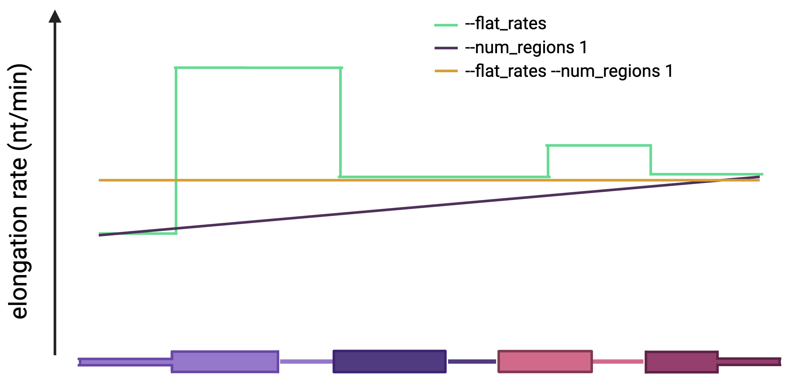
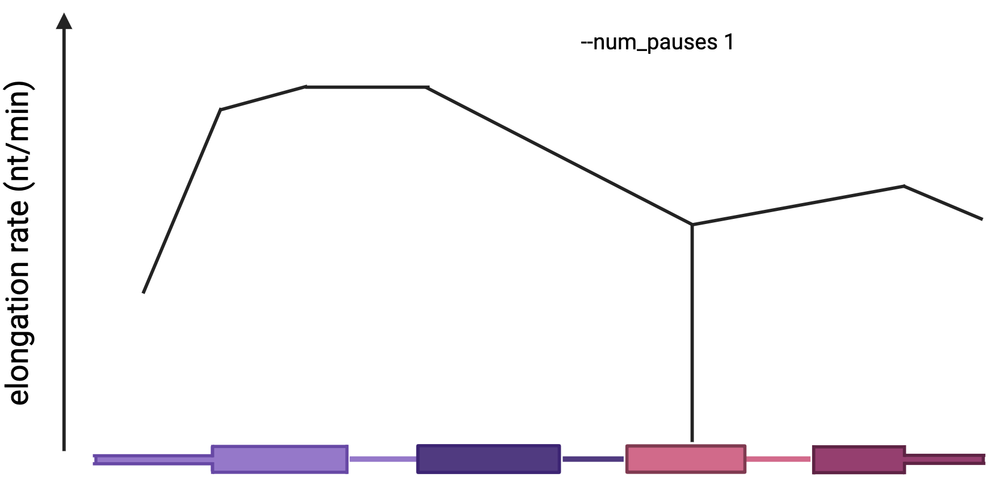

# SPARK: simulated pre-mRNA and RNA kinetics

SPARK (Simulated Pre-mRNA and RNA Kinetics) is a comprehensive simulation framework for generating nascent RNA benchmarking datasets. SPARK uses real gene sequences to simulate nascent RNA sequencing reads after performing in silico transcription, nascent RNA enrichment, and library preparation steps.

In brief, these simulations generate reads from annotated mRNA isoforms, generate transcription elongation rates for each nucleotide across a chosen number of genes. User-defined simulation parameters can be tuned to vary across a range of experimental conditions. SPARK can simulate conditions across a wide variety of nascent RNA sequencing approaches. During the process of _in silico_ RNA synthesis, users can choose methods that either mimic metabolic labeling or labeling of RNAP positions. To simulate metabolic labeling approaches like 4sU-seq or TT-seq, SPARK simulates the stochastic incorporation of nucleotide analogues (e.g., 4sU, 5-ethynyluridine (5eU)), while the incorporation of a “biotin-NTP” recreates the process of transcription termination inherent to run-on assays like PRO-seq.


### Requirements (versions used for development)
- python (v3.12.9)
- bedtools (v2.31.1)
- R (v4.3.3)
- bash (v4.4.20)
- awk (v4.2.1)

#### Python Dependencies
- numpy (v2.2.3)
- pandas (v2.2.3)

#### R Dependencies
- data.table (v1.17.0)
- dplyr (v1.1.4)
- optparse (v1.7.5)
- R.utils (v2.13.0)
- tidyr (v1.3.1)
- magrittr (v2.0.3)
- scales (v1.3.0)


A spark.yml conda environment is provided.
## Table of Contents

[Overview of SPARK (full pipeline)](#overview-of-spark)

[1. Gene Selection](#step-1-gene-selection)

[2. Elongation Rates](#step-2-elongation-rates)

[3. Nascent RNA generation](#step-3-nascent-rna-generation)

[4. Enrichment](#step-4-enrichment)
  - [Nascent RNA enrichment](#nascent-rna-enrichment)
  - [Transient transcriptome (TT)-seq](#transient-transcriptome-tt-seq)
  - [Precision Nuclear Run-on (PRO)-seq](#precision-nuclear-run-on-pro-seq)
  - [mammalian Native Elongating Transcript (mNET)-seq](#mammalian-native-elongating-transcript-mnet-seq)

[5. Read Generation](#step-5-read-generation)

[Ground truth](#ground-truth)
  - [Elongation rates & pausing](#elongation-rates--pausing)
  - [Nucleoside analog incorporation & substitution](#nucleoside-analog-incorporation--substitution)
  - [Fragmentation and size selection](#fragmentation-and-size-selection)
  - [For read mapping](#for-read-mapping)

## Overview of SPARK
The SPARK pipeline was designed to be run either as a single continuous pipeline or in individual modes to generate genes, transcription elongation rates, nascent RNA enrichment, or reads. Here, we describe the usage of the _fullpipeline_ mode and below, we provide sections that discuss each of the other modes individually and alternative parameter usage.

```
usage: spark.py
options:
  -h, --help            show this help message and exit

general arguments:
  --mode {fullpipeline,gene_selection,rates_per_region,mRNAgeneration,seq_tech}
                        pipeline step to run (default: None)
  -o O                  output directory (default: ./)
  --seed SEED           random seed for reproducibility (default: None)
  --experiment_type {nascentrnapd,proseq,ttseq,mnetseq}
                        type of experiment to simulate (default: None)
  --threads THREADS     Number of threads for parallel processing (default: 1)

tsv generation:
  --gtf GTF             genome annotation file (default: None)
  --genome_fasta GENOME_FASTA
                        genome fasta file (default: None)
  --protein_coding_only
                        only use protein-coding genes (default: False)
  --n_gene_clusters N_GENE_CLUSTERS
                        number of gene clusters (default: 6)
  --n N                 number of genes (default: 120)

rates per region:
  --region_size_range REGION_SIZE_RANGE
                        range of region sizes to split the gene into (default: None)
  --num_regions NUM_REGIONS
                        desired number of regions to split the gene into (default: None)
  --elong_rate_range ELONG_RATE_RANGE
                        range of elongation rates (default: 500,5000)
  --num_pauses NUM_PAUSES
                        number of pauses across the gene (default: 0)
  --pause_time PAUSE_TIME
                        length of the pausing event in minutes (default: 0.1,0.5)
  --flat_rates          all nucleotides have the same elongation rate (default: False)
  --promoter_pause_position PROMOTER_PAUSE_POSITION
                        range of positions for TSS pausing (default: 30,50)
  --promoter_pause_duration PROMOTER_PAUSE_DURATION
                        length of promoter pausing in minutes (default: 0,0)
  --initi_rate INITI_RATE
                        comma-separated range of seconds for initiation rate (default: 10,60)

mRNA generation:
  --experiment_time EXPERIMENT_TIME
                        experiment time in minutes (default: 15)
  --seq_err SEQ_ERR     sequencing error rate (default: 0.0001,0.0002)
  --nt_inc_prob NT_INC_PROB
                        comma-separated range of nucleotide incorporation probability (default: 0.09,0.1)
  --subs_prob SUBS_PROB
                        comma-separated range of nucleotide substitution probability if simulating nucleotide recoding (default: 0.95,1)
  --labeling_base {A,C,T,G}
                        Specify the base analog that will get incorporated into the nascentRNA (default: T)
  --sub_base {A,C,T,G}  Specify the identity of the base after conversion (default: None)
  --bkg_molecules BKG_MOLECULES
                        proportion of mRNA molecules that are derived from non-labeled RNA (default: 0)
  --drb                 DRB treatment experiment for transcription synchronization (default: False)
  --intron_half_life INTRON_HALF_LIFE
                        range of intron half life in minutes for the introns to simulate spliicng (default: 0.8,1.2)
  --nosplicing          If set, skip all splicing simulation steps (default: False)
  --mRNA_coordinates    If set, output a TSV with the coordinates of the surviving features (exons + retained introns) (default: False)

sequencing strategy:
  --seq_tech {longread,shortread}
                        sequencing technology (default: shortread)
  --seq_type {RNA,cDNA,SE,PE}
                        sequencing type (default: SE)
  --seq_depth SEQ_DEPTH
                        total library sequencing depth (default: 20000000)
  --insert_size INSERT_SIZE
                        length of insert (default: 200,300)
  --tpm TPM             range of TPMs genes can have (default: 5,200)
  --read_length READ_LENGTH
                        length of each read (default: 100)
  --s {rf,fr,unstranded}
                        library strandedness (default: rf)
  --fragments           export a ground truth for fragmentation & size selection (default: False)
```

**Snippet to simulate 100nt fr-firststrand paired-end reads from 1000 genes from a TTseq library:**
```
spark.py --mode fullpipeline -o ./out_dir/ --experiment_type ttseq  --n 1000 --gtf GRCh38.95.gtf --genome_fasta GRCh38.fa --s rf  --seq_type PE --experiment_time 5
```
The final simulated libraries will be located in the out_dir/final_libraries/ directory. The file names are designed to be informative and follow a consistent structure. One fastq file is generated per read (e.g., R1 and R2 for paired-end). The naming convention is {seq_tech}_{experiment_type}_{seq_type}_{date}_{read}.fastq.gz. For example, for a paired-end, short-read nascentrnapd experiment simulated on November 3, 2025, these are the output files:
shortread_nascentrnapd_PE_20251103_R1.fastq.gz
shortread_nascentrnapd_PE_20251103_R2.fastq.gz

SPARK can be run in full or as specific modules to change specific parameters of the simulation while keeping others constant. Users can choose to input a seed to replicate the randomly assigned values (e.g., elongation rates) across runs.

### Reusing Simulated Data Across Runs
SPARK can share simulated data (like generated mRNAs) between different experimental runs. To do this, simply use the same output directory (-o) for each subsequent run. For example, you can first simulate a nascentrnapd experiment. This will generate a set of mRNAs in the specified output directory (./out_dir/).
```
# Run 1: Generates simulated mRNAs for a nascentRNAPD experiment
spark.py --mode fullpipeline -o ./out_dir/ \
 --experiment_type nascentrnapd --n 1000 \
 --gtf GRCh38.95.gtf --genome_fasta GRCh38.fa \
 --s rf --seq_type PE --experiment_time 15
```
Next, to run an mnetseq experiment using the exact same simulated mRNAs from the first run, just point to that same output directory. spark.py will automatically detect and reuse the existing data with a different enrichment method (see below).
```
# Run 2: Reuses mRNAs from Run 1 to generate an mNETseq experiment
spark.py --mode seq_tech -o ./out_dir/ --experiment_type mnetseq --s rf --seq_type PE
```

### Step 1: Gene Selection

**Clustering by gene features (```--mode tsvgeneration```)**

SPARK is designed to select genes from which to simulate nascent RNA reads that represent a diversity of genomic features. Users specify the number of genes from which they would like to simulate reads and provide: (1) a gtf with gene annotations and (2) a reference fasta file. For each gene, the longest isoform (upstream-most transcript start site and downstream-most transcript end site) is selected, and its features are used for classification. Genes in the gtf are first categorized by gene length, total transcript length(s), number of exons, mean exon lengths, number of introns, mean intron lengths, first intron length, lengths of 5′ and 3′ untranslated regions (UTRs), and exonic and intronic nucleotide composition. Hierarchical clustering is used to identify clusters of transcripts with similar characteristics. 

The number of genes to simulate can be established using ```--n```, and the number of clusters to divide genes in can be changed with ```n_gene_clusters```. An equal number of genes is selected from each cluster for downstream simulations, ensuring a balanced and unbiased set of genes reflecting genome diversity. SPARK can also simulate genes for any species with annotated genomes and selected genes from a pre-filtered gtf file. This is 


### Step 2: Elongation Rates. 

**Assigning an RNA Pol II elongation rate per nucleotide (```--mode rates_per_region```)**

RNAPII elongation rates are likely not static across a gene. Additionally, any changes in elongation rates likely occur continuously, rather than in a step-wise fashion. To simulate the variability in elongation rates across the gene sequence, this mode will assign an elongation rate (in the range specified by ```--elong_rate_range```) to each nucleotide of the isoform. Elongation rates within this range are assigned to regions whose length is chosen from the range specified by ```--region_size_range```. Within each region, the elongation rate (in nt/min) changes linearly from the rate at the first nucleotide to the rate at the last nucleotide in that region. For example, in a 10nt region that starts at 1 nt/min and ends at 2nt/min, nucleotide #1 = 1 nt/min, #2 = 1.22, #3 = 1.33, ... until #10 at 2 nt/min.


To simulate step-wise changes in elongation rates, users can specify ```--flat_rates``` to ensure all the nucleotides in a region have the same elongation rate. To simulate a single elongation region across the entire gene, users can specify the number of regions with a the same elongation rate per nucleotide using ```--num_regions```.  Specifying both ```--flat_rates``` and ```--num_regions 1``` will create a single constant elongation rate across the entire gene.




During the length of the simulated experiment, the gene-initiation rate will determine how often a new mRNA molecule starts getting elongated. The frequency of that process can be modulated using ```--initi_rate```. 

Finally, users can choose to include RNAP pausing events throughout the gene. Pause sites can be placed randomly across the gene. The number and duration of those events can be modulated with --num_pauses and --pause_time, respectively. TSS pausing can also be added using ```--promoter_pause_position``` and ```--promoter_pause_duration```.




#### Output files
Two output files per gene will be created in a new directory named _rate_per_gene_ to record the ground truth of elongation rates. The _RatesandTraversalTimes_ files contain the elongation rate per nucleotide, while the _VariableElongationRateRegions_ files contain the elongation rate variability information per region (see the [ground truth](#ground-truth) section for details of file format).


###  Step 3: Nascent RNA generation

**mRNA generation (```--mode mRNAgeneration```)**

SPARK first simulates full-length pre-mRNA isoforms based on the elongation rates generated by ```--mode rates_per_region```. Using these rates, transcription is simulated to create nascent pre-mRNA transcripts. The length of the experiment is specified by ```--experiment_time```, which also determines how far RNAPII elongates after its starting point at the beginning of the labeling period. Specifically, the labeling time is used to calculate a total elongation distance considering the cumulative elongation rates across the gene. These molecules can be labeled with a nucleotide analog or not, depending on the specified ```--experiment_type```. 

For nucleoside-analog dependent experiment types (```--experiment_type nascentrnapd```,  ```--experiment_type proseq```, or ```--experiment_type ttseq```), SPARK will simulate temporally-resolved nascent RNA sequencing using metabolic labeling. There are several parameters that determine the labeling probability, detection, and efficiency. During this “time”, the probability that a labeled nucleotide specified with ```--labeling_base``` is _in-silico_ incorporated into nascentRNA molecules is specified by ```--nt_inc_prob```. Once incorporated, the probability that these labeled nucleotides undergo nucleoside re-encoding is specified by ```--subs_prob```. The nature of this re-encoding is specified by ```--sub_type```. For example, iodoacetamide or TFEA-induced re-encoding of 4sU results in a T-to-C conversion, so ```--sub_type T,C``` would simulate eSLAM-seq or enriched TimeLapse-seq experiments.

Two transcriptional conditions can be simulated using ```--drb```: 
(1) Nascent RNA enrichment after transcription synchronization with DRB  (_i.e._ 4sUDRB-seq), such that all RNAPIIs initiate at the transcription start site at the start of the labeling window. (including ```--drb```)

(2)  A native context assuming steady-state transcription, in which RNAPII are already distributed across the gene body when labeling begins. (default, not including ```--drb```)

### Step 4: Enrichment

Following the synthesis of RNA molecules, SPARK can generate reads from one of four nascent RNA experimental approaches: metabolic labeling with full-molecule nascent RNA enrichment, metabolic labeling with fragmented nascent RNA enrichment, RNAP run-on, or nascent RNA associated with elongating RNAPs. 

#### Nascent RNA enrichment
The nascent RNA enrichment experimental mode (```--experiment_type nascentrnapd```) simulates a 4sU-seq style nascent RNA pulldown experiment by conditioning on full-length molecules that have at least one nucleotide analog incorporated.

#### Transient transcriptome (TT)-seq
The TT-seq experimental mode (```--experiment_type ttseq```) simulates a TT-seq style experiment by performing in silico fragmentation (see below) directly after full-length RNA generation and labeling but before nascent RNA enrichment. After this fragmentation, SPARK enriches for nascent RNA fragments (rather than nascent RNA molecules). Fragments that do not contain at least one nucleotide analog are discarded from the population of fragments before proceeding to library preparation.

#### Precision Nuclear Run-on (PRO)-seq
The PRO-seq experimental mode (```--experiment_type proseq```) simulates a run-on assay by simulating the incorporation of a biotinylated nucleotide during the in silico transcription process. The most upstream biotin-NTP incorporation event then defines the 3' terminus of the nascent transcript by truncating the molecule at that nucleotide. Truncated molecules then proceed to the in silico fragmentation module (see below), in which only the 3'-most fragment containing the singular biotin-NTP is retained for subsequent library preparation simulation.

#### mammalian Native Elongating Transcript (mNET)-seq
The mNET-seq experimental mode (```--experiment_type mnetseq```) simulates RNAP pulldown-based nascent RNA sequencing assays by identifying all molecules actively undergoing elongation at the end of the simulated experiment time. The simulation mimics RNAP pulldown followed by MNase digestion. For each actively transcribing molecule (RNAP has not reached the 3’ end of the gene), SPARK extracts the 3'-terminal fragment that represents the nascent RNA physically protected by the RNAPII complex by selecting the last N nt of the molecule, where N is drawn from a uniform distribution between 35-100 nucleotides. Only these 3’ fragments are retained for subsequent library preparation steps.


The simulation labeling framework also allows for the introduction of two background signal sources:  

Errors (substitutions) are introduced by technical steps in the experiment (e.g., base calling from sequencing). These errors can be incorporated by specifying ```--seq_err```, which sets the probability that there will be a random substitution at any base in the molecule.

Background, non-nascent transcripts. These are transcripts that are not transcribed during the labeling window, but may be present due to inefficient or non-specific enrichment. This is specified by ```--bkg_molecules```, which sets a proportion of the molecules derived from background depending on the chosen ```--experiment_type```:
-For nascentPD, it's the proportion of mRNA molecules generated that are full-length and have no labeling nucleotides.
-For mNET is a random fragment of 35-100nt that is generated from the full-length molecule.
-For Pro-seq is the proportion of unlabeled fragments (with no NTP-biotin) that are kept after the fragmentation step.
-For tt-seq is the proportion of unlabeled fragments (no nucleoside analog) that are kept after the fragmentation step.


NOTE: This version of SPARK does not consider splicing, so transcripts are simulated as continuous, uninterrupted isoforms. If background molecules are simulated, they are assumed to be fully elongated and unspliced pre-mRNA molecules, representing transcripts not generated during the labeling window.

### Step 5: Read Generation

**Read generation (```--mode seq_tech```)**

SPARK can generate either short-read or long-read sequencing reads from the mRNA transcripts produced by the ```--mode labeling_strategy``` step. The choice of sequencing technology is specified by ```--seq_tech```, which has options for _shortread_ (e.g. Illumina) or "longread" (e.g., Oxford Nanopore Technologies). By default, SPARK simulates short-read sequencing.

To simulate the number of reads that might be generated by genes that are expressed at different levels, a gene expression level is chosen from the range specified by  ```--tpm```.  The number of reads is also dependent on ```--seq_depth```, which defines the total number in the _in-silico_ library

For short-read simulations, fragmentation and size selection are modeled after the simulations described in [Pai _et al._, eLife 2017](https://elifesciences.org/articles/32537). Fragment insert sizes are specified by ```--insert_size```. Read length is specified by ```--read_length parameter```. The simulation of single-end (_SE_) or paired-end (_PE_) is specified by ```seq_type```. Finally, strandedness is specified by ```--s```, choosing from reverse-forward (_rf_), forward-reverse (_fr_), or _unstranded_. The default is _rf"_, which is typical for dUTP-based strand-specific RNA-seq protocols.

For long-read data, SPARK defaults to Oxford Nanopore strand specifications: for directRNA, transcripts are sequenced in the 3′ to 5′ direction, while cDNA reads may originate from either end. This behavior is specified by ```--seq_type```, which can be set to "RNA" or "cDNA" for long reads.

### Ground truth

SPARK can output multiple types of ground truth that can be used to validate a diversity of benchmarking metrics.

#### Elongation rates & pausing

1. Regions over which elongation rates are varied, including the position of pausing events, which are stored in the ```out_dir/rate_per_region/*_VariableElongationRateRegions.tsv``` files containing the elongation rate information per region:

| Column Name          | Description                                                                 |
|----------------------|-----------------------------------------------------------------------------|
| chromosome           | gene chromosome                                                             |
| absolute_start       | absolute start position of the region                                       |
| absolute_end         | absolute end position of the region                                         |
| region_start_coord   | relative start position of the region                                       |
| region_end_coord     | relative end position of the region                                         |
| strand               | strand                                                                      |
| rate_initial         | elongation rate in bp per minute for the first nucleotide in the region     |
| rate_final           | elongation rate in bp per minute for the last nucleotide in the region      |
| rate_change_per_nt   | change in rate for each individual nucleotide in the region                 |
| time_to_traverse     | time to traverse the entire region                                          |
| sequence             | region sequence                                                             |
| region_number        | gene region the nucleotide belongs to                                       |

2. Per nucleotide elongation rates, including the position of pausing events, which is stored in the ```out_dir/rate_per_region/*_RatesandTraversalTimes.tsv``` files:

| Column Name           | Description                                                                 |
|------------------------|-----------------------------------------------------------------------------|
| chromosome             | gene chromosome                                                             |
| absolute_position      | absolute position of each nucleotide                                        |
| strand                 | strand                                                                      |
| region_number          | gene region the nucleotide belongs to                                       |
| nucleotide_coord       | relative position of the nucleotide within the gene                         |
| time_for_this_nt       | time in minutes required to traverse the nucleotide                         |
| rate_for_this_nt       | elongation rate in bp per minute for the nucleotide                         |
| rate_change_per_nt     | elongation rate change between nucleotide n and n+1                         |


#### Nucleoside analog incorporation & substitution

The read names contain information if a nucleoside analog experiment was simulated (```--experiment_type nascentrnapd, --experiment_type proseq, or --experiment_type ttseq```). The names have the number and position of incorporated and converted nucleotides (if any) in the read. For example:

```
@XWXMPWMRCUZtzkbq_12:108628977-108628878:-_ninc2:27,70_nsubs0:
Read ID: XWXMPWMRCUZtzkbq
Number of modified nucleotides in the read: 2
Position of the modified nucleotides in the read: 27,70
Number of substitutions: 0
Position of the substitutions in the read: NA
```
```
@2LOX927M95Ifdjie_12:108626879-108626780:-_ninc3:17,21,90_nsubs1:21:
Read ID: 2LOX927M95Izaouk
Number of modified nucleotides in the read: 3
Position of the modified nucleotides in the read: 17,21,90
Number of substitutions: 1
Position of the substitutions in the read: 21
```

Each read's ID begins with a capitalized section; reads coming from the same mRNA molecule share this capitalized ID prefix. A lowercase suffix will then differentiate individual reads. For read pairs, both reads will have identical IDs.

Background molecules, coming from unspecific enrichment steps, will contain ‘BG’ on their names but no nucleoside analog incorporation or substitution due to them being background: 
```
@69UOVR0SU3O_BG_zvhzi_12:108625373-108625274:-_ninc0:_nsubs0:
```

#### Fragmentation and size selection

For experiments that involve a size selection step (e.g., ```--experiment_type nascentrnapd or --experiment_type ttseq```), you can save the ground truth per-base coverage data from before and after this step. To enable this, add the --fragments argument to your command.

When this option is used, SPARK will create two directories in your output folder, containing files with the per-base coverage data:

```out_dir/ground_truth_pre_size_selection/```
This directory contains the coverage data after fragmentation but before the size selection is applied.

```out_dir/ground_truth_after_size_selection/```
This directory contains the final coverage data after the size selection has been applied.

#### For read mapping
To use SPARK to benchmark read alignment under different experiment simulation conditions, the read names contain the genomic coordinates from which each read was simulated from:

```
@CN1369NOND9qjfsv_12:108625124-108625025:-_ninc5:52,50,37,21,94_nsubs0:
Read ID: CN1369NOND9qjfsv
Chromosome: 12
Start: 108625124
End: 108625025
Strand: -
Number of modified nucleotides in the read: 5
Position of the modified nucleotides in the read: 52,50,37,21,94
Number of substitutions: 0
Position of the substitutions in the read: NA
```

